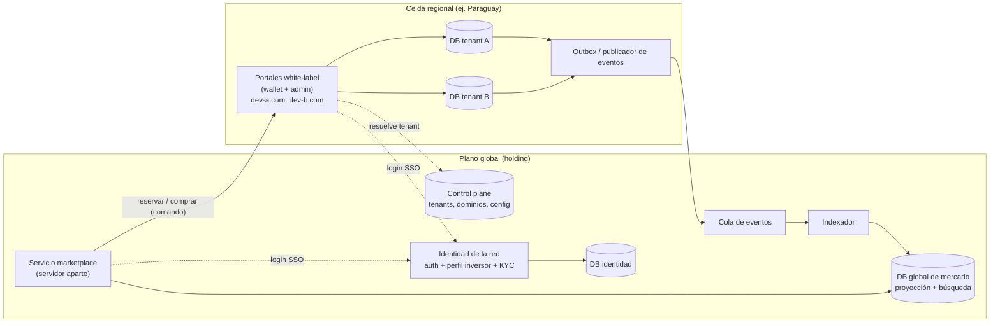

# Arquitectura multi-tenant y marketplace global — octubre 2026

Propuesta técnica para soportar **muchas desarrolladoras (tenants)** sobre la misma plataforma y, más adelante, un **marketplace global** donde se vendan proyectos de todas ellas. Bajada técnica de [plan-2026-oct.md](./plan-2026-oct.md) (etapas 1 y 4, decisiones D5, D9, D11) y revisión de la estrategia "multi-tenant en tiempo de despliegue" de [status-2026-sep.md](./status-2026-sep.md) §3.6.

Idea central, en una línea: **datos operativos aislados por desarrolladora, identidad del inversor compartida en la red, y un índice global de solo lectura alimentado por eventos, servido por un servicio de marketplace desplegado aparte.**

---

## 1. Requisitos que salen del plan de negocio

| # | Requisito | Origen |
| --- | --- | --- |
| R1 | Cada desarrolladora tiene su portal white-label: marca, dominio, configuración y flujos propios | Plan §4.8, D11 |
| R2 | Los datos operativos de una desarrolladora (inventario, reservas, pagos, leads) están aislados y son **exportables** | Plan §6.3, D5 |
| R3 | La cuenta del inversor pertenece a **la red**: un inversor registrado con la desarrolladora A puede descubrir y comprar a la desarrolladora B sin registrarse de nuevo (y sin repetir KYC si consiente) | Plan §3, D5 |
| R4 | Un marketplace regional busca y lista proyectos de **todas** las desarrolladoras, con disponibilidad razonablemente actualizada | Plan §3 etapa 4 |
| R5 | El día de lanzamiento (reserva por orden de llegada) debe ser **consistente** y aguantar picos de tráfico de una desarrolladora sin afectar a las demás | Plan §4.1 |
| R6 | Expansión país por país con OpCos locales: los datos y licencias (PSAV, KYC, pagos) pueden ser jurisdiccionales | Plan §7 |
| R7 | Algunas desarrolladoras pedirán personalización fuerte (forks), pero igual tienen que poder publicar en el marketplace | Status §3.6, D9 |
| R8 | Al principio somos pocos y con pocos clientes: el costo operativo por tenant tiene que ser bajo | Plan §6, §8 |

---

## 2. Modelos de aislamiento considerados

| Modelo | Cómo es | Ventajas | Desventajas |
| --- | --- | --- | --- |
| **A. Base compartida con `tenant_id`** | Una sola base, todas las tablas con `tenant_id` (+ RLS en Postgres) | Simple de operar, consultas cruzadas triviales (marketplace "gratis") | Un bug de filtrado filtra datos entre desarrolladoras. Exportar o borrar a un cliente es más delicado. Un lanzamiento grande afecta a todos. Difícil ubicar datos por país. |
| **B. Base por tenant** (silo) | Cada desarrolladora tiene su propia base con el mismo esquema | Aislamiento fuerte, export/borrado = la base entera, backups y restore por cliente, carga aislada en lanzamientos, se puede ubicar por región | Migraciones en N bases. Las consultas cruzadas necesitan otra pieza (índice global). |
| **C. Despliegue completo por tenant** (lo que dice status §3.6) | App + base por cliente, posiblemente un fork | Libertad total para personalizar | Caro de operar con muchos clientes, las versiones divergen, el marketplace no puede asumir nada del esquema. |

**Recomendación: B como modelo por defecto, C como excepción, nunca A para datos operativos.**

- La app se despliega **una vez por región/país** y resuelve el tenant en tiempo de ejecución (por dominio), pero cada tenant tiene **su propia base**. Esto es "app compartida, datos en silo".
- Encaja con el stack actual: `@repo/db` ya usa Drizzle + libSQL/SQLite. libSQL (Turso o self-hosted `sqld`) está pensado para miles de bases chicas, baratas y con réplicas; una base por desarrolladora es casi gratis.
- Un cliente con personalización fuerte (C) se despliega aparte, pero tiene que cumplir el **contrato de tenant** (§6) para conectarse a la red. Así la estrategia "por despliegue" del status sigue siendo posible sin romper el marketplace.

---

## 3. Vista general

Cuatro piezas con responsabilidades separadas:

1. **Plano de tenant** (por región): app wallet/admin y una base por desarrolladora. Es la **fuente de verdad** de proyectos, unidades, etapas, reservas, pagos y cuotas.
2. **Control plane** (global): qué tenants existen, en qué región viven, sus dominios, marca, feature flags, plan comercial y la URL/credenciales de su base.
3. **Identidad de la red** (global o por jurisdicción, ver §5): cuentas de inversor, login, KYC reutilizable y consentimientos.
4. **Marketplace** (global, desplegado aparte): una base global que es **solo una proyección** de lo que los tenants publican, más búsqueda. Nunca es fuente de verdad del inventario.

---

## 4. Qué datos viven dónde

Mapeo de las tablas actuales de `packages/db/src/schema.ts`:

| Dominio | Tablas actuales | Dónde vive | Notas |
| --- | --- | --- | --- |
| Identidad y sesión | `users`, `accounts`, `sessions`, `native_auth_codes`, `native_refresh_tokens` | **Identidad de la red** | El tenant guarda solo un `network_user_id` + perfil comercial local (ver abajo). |
| KYC | `kyc_applications` | **Identidad de la red** (por jurisdicción) | Reutilizable entre desarrolladoras **con consentimiento** del inversor. La desarrolladora ve el estado y lo que el inversor le compartió. |
| Catálogo | `projects`, `units`, `stages`, `purchase_options`, `project_stories` | **DB del tenant** | Se publica al mercado como proyección (§6). |
| Operación comercial | reservas, depósitos de acceso, cuotas, leads, corredores (a construir) | **DB del tenant** | Incluye `investor_profiles` (relación del inversor con *esta* desarrolladora: notas, corredor asignado, consentimientos). |
| Dinero | `balances`, `transactions` | **DB del tenant** | La desarrolladora es la que cobra. Cada pago se asocia al `network_user_id`. |
| Tokenización y mercado secundario | `market_tokens`, `holdings`, `positions`, `trades`, `fireblocks_*` | **Servicio de la OpCo con PSAV** (por país), no por tenant | Es una actividad regulada de la OpCo, no de la desarrolladora. Etapa 3; queda fuera del alcance inmediato. |
| Configuración | marca, dominios, flags, plan | **Control plane** | |

Regla para el código: toda consulta del plano de tenant usa un cliente Drizzle **obtenido a partir del tenant resuelto** (`getTenantDb(tenantId)`), nunca un cliente global importado directamente. Esto se puede forzar con lint y con la forma del paquete `@repo/db`.

---

## 5. Identidad del inversor en la red

Es la pieza que hace posible el marketplace (R3) y la que más afecta la confianza de desarrolladoras y reguladores (D5).

- **Un servicio de identidad central** (`auth.realinvest.com`, o por país si lo exige la regulación) actúa como proveedor OIDC. Hoy Auth.js vive dentro de wallet; habría que extraerlo.
- Cada portal white-label hace **login SSO con la marca de la desarrolladora** (la pantalla de login se renderiza con el tema del tenant que inició el flujo). Para el inversor es "la app de la desarrolladora"; por detrás es una cuenta de la red.
- Al primer acceso a un tenant se crea su `investor_profile` en la base de ese tenant y se registra el **consentimiento** (qué datos y KYC comparte con esa desarrolladora).
- **Lo que la desarrolladora "posee"**: su relación comercial (`investor_profiles`, reservas, pagos, comunicaciones), exportable completa. **Lo que posee la red**: la credencial de login, el KYC reutilizable y la vista consolidada del portafolio.
- **Portafolio consolidado** (el inversor ve sus compras en todas las desarrolladoras): se arma desde una proyección en la DB global (`investor_holdings_summary`) alimentada por los mismos eventos, no consultando N bases en cada request.
- **Jurisdicción:** el KYC y algunos datos personales pueden tener que quedar en el país. Diseño recomendado: identidad lógica global (un `network_user_id`), almacenamiento de datos KYC en la región de la OpCo correspondiente. Para el piloto en Paraguay alcanza con una sola instancia.

---

## 6. Contrato de tenant y flujo hacia el marketplace

Para que tenants "pooled" y despliegues dedicados (forks) puedan publicar igual, el marketplace **no lee bases de tenants**: consume un contrato versionado.

### 6.1 Eventos (tenant → red)

- Cada tenant escribe en una tabla **outbox** dentro de su propia base, en la misma transacción que el cambio de negocio (patrón transactional outbox). Un publicador los envía a la cola global.
- Eventos mínimos (`v1`):
  - `project.published` / `project.updated` / `project.unpublished` (datos públicos: ubicación, tipologías, rango de precios, fechas de lanzamiento, media)
  - `stage.opened` / `stage.closed` / `stage.price_changed`
  - `unit.availability_changed` (disponible, bloqueado, vendido, próximamente)
  - `reservation.confirmed`, `purchase.completed` (para portafolio consolidado y comisiones del marketplace)
- Solo se emiten proyectos que la desarrolladora **marcó como publicables en el marketplace** (y los de socios fundadores según contrato, D4).
- Esquemas en un paquete compartido (`packages/contracts`, con Zod) y versionados. Un fork que no use nuestro código igual puede cumplirlo.
- Alternativa más simple para empezar: un job que cada N minutos llama a un endpoint `GET /network/v1/catalog?since=` de cada tenant. Sirve para el piloto; los eventos son necesarios cuando haya días de lanzamiento listados en el marketplace.

### 6.2 Comandos (marketplace → tenant)

- Reservar, pagar el depósito de acceso o comprar **siempre se ejecuta en el tenant**, que es dueño del inventario. El marketplace llama a la API del tenant (`POST /network/v1/reservations`) autenticado como servicio + el token del inversor, o redirige al portal de la desarrolladora con SSO.
- Recomendación inicial: **redirigir** al portal white-label para la transacción. Es más simple, mantiene la marca de la desarrolladora en el cierre y evita duplicar flujos de pago. La reserva directa desde el marketplace se agrega después.

### 6.3 Consistencia

- La DB global es **eventualmente consistente** (segundos). Sirve para buscar, filtrar y mostrar "quedan ~N unidades".
- La disponibilidad exacta y la asignación por orden de llegada del día de lanzamiento se resuelven **solo en la DB del tenant** (transacción + bloqueo de la unidad). Si el índice dice "disponible" y la unidad ya se vendió, el tenant rechaza y el marketplace muestra el error.

---

## 7. El servicio de marketplace (servidor aparte)

Sí conviene desplegarlo separado:

- **Perfil de carga distinto:** tráfico público, anónimo, de lectura y SEO; picos por campañas. No debe competir con la operación de las desarrolladoras ni viceversa.
- **Seguridad:** no tiene credenciales de las bases de tenants. Si se compromete, expone solo datos ya públicos.
- **Ciclo de release propio** y posibilidad de vivir en otra región/CDN más cerca de inversores internacionales.

Componentes:

| Componente | Propuesta | Notas |
| --- | --- | --- |
| Frontend | App Next.js nueva (`apps/market`), SSR/ISR para SEO | Marca global Real Invest (D11). Reusa `@repo/ui`. |
| API | Lectura sobre la DB global; comandos delegados al tenant | Stateless, escala horizontal. |
| DB global | **Postgres** (relacional, buen soporte geo con PostGIS, FTS básico) | Separada de libSQL a propósito: es una base de agregación, no un silo. |
| Búsqueda | Empezar con Postgres FTS + filtros; pasar a **Typesense o Meilisearch** si hace falta facetado, typo-tolerance o búsqueda multilingüe | El indexador escribe en ambos. |
| Indexador | Worker que consume la cola y actualiza proyecciones idempotentemente (por `event_id` + versión) | Permite reconstruir el índice desde cero pidiendo un snapshot a cada tenant. |
| Cola | Algo simple al principio (Postgres como cola, o Redis Streams / NATS) | No hace falta Kafka para este volumen. |

---

## 8. Topología de despliegue

- **Celda regional** (una por país/OpCo): wallet + admin multi-tenant, bases libSQL de sus tenants, publicador de eventos. Permite cumplir residencia de datos y que cada OpCo opere lo suyo (plan §7).
- **Plano global** (holding): control plane, identidad (o su capa lógica), cola, indexador, DB global y marketplace. Coincide con que la holding controle código, marca y marketplace.
- **Tenants dedicados:** despliegue aparte (posiblemente fork) que se registra en el control plane, usa la identidad de la red y emite el contrato de eventos.
- **Resolución de tenant:** middleware de Next.js mapea `host` → `tenantId` vía control plane (con caché), carga tema/config y obtiene el cliente de DB. Dominios propios con TLS automático (el Caddy local ya simula `local.*.realinvest.com`).
- **Migraciones:** un runner aplica las migraciones de Drizzle a todas las bases de la celda, tenant por tenant, con registro de versión en el control plane. La app tolera esquema N y N-1 durante el rollout (cambios expand/contract).

---

## 9. Fases

| Fase | Cuándo | Qué | Por qué así |
| --- | --- | --- | --- |
| **0. Piloto Paraguay** | oct–dic 2026 | Control plane mínimo (tabla `tenants` + dominios), resolución por host, **una base libSQL por desarrolladora**, `getTenantDb()`. Auth sigue en wallet pero el usuario ya tiene un `network_user_id` estable y se separa `investor_profiles`. | Poner la frontera de datos ahora es barato; moverla con clientes reales es caro. |
| **1. Identidad de la red** | Q1 2027 | Extraer auth a servicio OIDC con login con marca del tenant, KYC reutilizable con consentimiento. | Requisito para que un inversor use dos desarrolladoras sin re-registrarse. |
| **2. Contrato y proyección** | Q1–Q2 2027 | `packages/contracts`, outbox, cola, indexador, DB global Postgres. Portafolio consolidado. | Se puede construir sin marketplace público; ya da valor (portafolio único). |
| **3. Marketplace público** | cuando haya masa crítica | `apps/market` desplegado aparte, búsqueda, redirección SSO al portal para transaccionar. | Plan etapa 4. |
| **4. Multi-país** | con la segunda OpCo | Segunda celda regional, KYC por jurisdicción, marketplace transfronterizo. | Plan §7. |

---

## 10. Decisiones a tomar

| # | Decisión | Opciones | Recomendación |
| --- | --- | --- | --- |
| MT1 | Modelo de aislamiento | Base compartida / base por tenant / despliegue por tenant | **Base por tenant** con app compartida por región; despliegue dedicado solo como excepción paga. |
| MT2 | Motor de las bases de tenant | libSQL (Turso o `sqld` propio) / Postgres con schema por tenant | **libSQL**: ya es el stack actual y está pensado para muchas bases chicas. Revisar si aparece un cliente con volumen grande. |
| MT3 | Motor de la DB global | Postgres / libSQL / solo motor de búsqueda | **Postgres** + FTS, sumar Typesense/Meilisearch cuando lo pida el producto. |
| MT4 | Alcance de la identidad | Global única / por país / por tenant | **Identidad lógica global**, datos KYC almacenados por jurisdicción. Nunca por tenant (rompe R3). |
| MT5 | Sincronización al marketplace | Polling de catálogo / eventos con outbox | Polling en el piloto, **outbox + eventos** antes de listar lanzamientos en el marketplace. |
| MT6 | Dónde se transacciona una compra iniciada en el marketplace | En el marketplace / redirigiendo al portal del tenant | **Redirigir con SSO** al principio. |
| MT7 | Soporte de forks | Prohibido / permitido con contrato | Permitido si cumple el contrato de tenant (`packages/contracts`) y usa la identidad de la red. |

---

## 11. Riesgos

- **Migraciones en N bases fallan a mitad de camino.** *Mitigación:* runner idempotente con versión por tenant en el control plane, cambios expand/contract, alertas.
- **El índice global muestra disponibilidad vieja** en un lanzamiento. *Mitigación:* el tenant es la única autoridad; el marketplace muestra disponibilidad "aproximada" y deriva el lanzamiento al portal.
- **Fuga de datos personales al plano global.** *Mitigación:* los eventos llevan solo datos públicos del catálogo y IDs; datos personales viajan solo dentro de identidad con consentimiento.
- **Divergencia de forks.** *Mitigación:* el contrato es lo único obligatorio y está versionado; lo demás puede divergir.
- **Sobre-ingeniería temprana.** *Mitigación:* la fase 0 solo agrega control plane mínimo y base por tenant; identidad, eventos y marketplace se construyen cuando el negocio los necesite.
